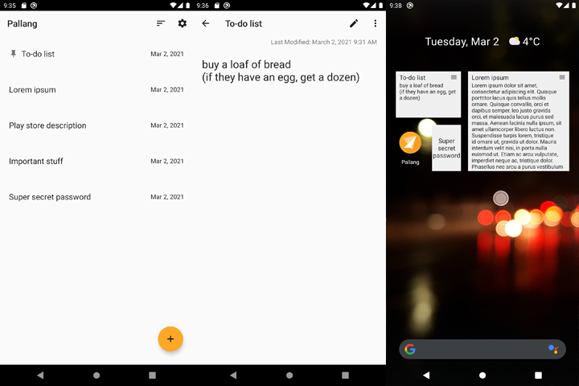

# Pallang

[Get it on Google Play](https://play.google.com/store/apps/details?id=com.sinu.pallang)

Pallang is a note-taking app for Android, built with simplicity in mind. Take a note, write a journal, make a story with Pallang.

## Design Goals

Pallang aims to be simple, clutter-free note-taking app that provides the simplest, fastest way to start writing stuff.

Its few design goals are:
- No network-involved functionality.
- No excess, complex, hard-to-use functionalities. Keep the app simple and easy.

## License

Pallang is distributed under the terms of the MIT License. Check LICENSE file for more details.